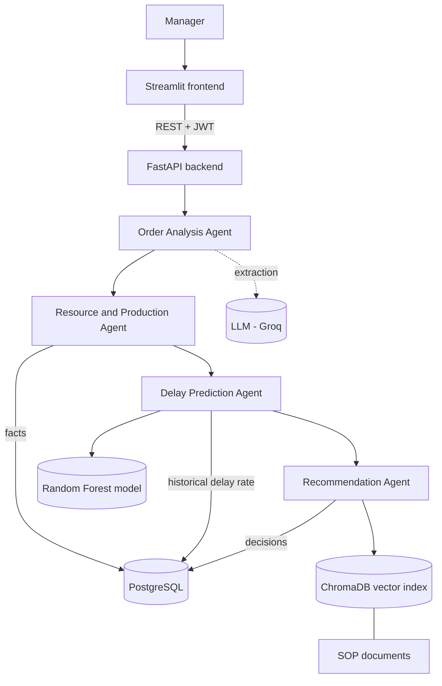

FabricFlow
Textile Multi-Agent AI System for Production Delay Prediction and Intelligent Order Management
FabricFlow helps textile and garment manufacturers find production delays early. It reads a customer order, checks the factory's resources, predicts the probability of a delay, and recommends corrective actions to a manager. The principle of the design is simple: the AI recommends, the human manager decides.
> Course project for IT3041 – Information Retrieval and Web Analytics (SLIIT).
---
Table of Contents
Overview
Key Features
How It Works
System Architecture
The Four Agents
Tech Stack
Project Structure
Getting Started
Environment Variables
Using the Application
Demo Scenarios
Machine Learning Model
Knowledge Base
API Overview and Examples
Responsible AI and Security
Testing
Troubleshooting
Known Limitations
Roadmap
Contributing and Git Workflow
Team
---
Overview
Textile factories lose time and money when orders are late. Delays come from machine breakdowns, limited machine capacity, material shortages, supplier delays, rework, and unrealistic deadlines. A single prediction number does not help a manager much, so FabricFlow goes further:
it understands the order (from typed text or a PDF),
checks machines, materials and suppliers in the database,
predicts the delay probability with a machine-learning model,
explains the main reasons for the risk,
retrieves relevant standard operating procedures (SOPs), and
proposes corrective actions that a manager approves or rejects.
Key Features
Order intake from text or PDF. An LLM turns free text into a structured order. Missing fields are sent back for clarification instead of being guessed.
Database-driven resource check. Machine capacity, workload, material stock and supplier lead time come from PostgreSQL. All calculations are done in Python, never by the LLM.
Delay prediction with machine learning. A scikit-learn Random Forest outputs a delay probability. The LLM never calculates the probability.
Explainable risk. Each prediction shows its top contributing factors and a plain-language explanation.
Grounded recommendations. Actions are backed by SOP documents retrieved from a local vector index (information retrieval). Actions that no SOP supports are dropped, not invented.
Human in the loop. Every recommendation requires manager approval. Decisions are stored for audit.
Authentication. Managers sign up and sign in with a Manager ID and password; the API uses JWT tokens.
Manager dashboard. Order, risk and decision overview with charts.
How It Works
```
Customer order (text or PDF)
        |
        v
 Order Analysis Agent          -> structured order (LLM, validated)
        |
        v
 Resource & Production Agent   -> machine, material and supplier facts + calculations (PostgreSQL + Python)
        |
        v
 Delay Prediction / Risk Agent -> delay probability + risk level + top factors (scikit-learn)
        |
        v
 Recommendation Agent          -> SOP retrieval + corrective actions (vector search + rules)
        |
        v
 Manager review                -> Approve / Reject / Override (human in the loop)
```
The output of each agent is the input of the next agent. Agents communicate through REST endpoints using structured JSON.
System Architecture

Design choice	Reason
Facts come from PostgreSQL	The LLM must never guess machine capacity, stock or lead time
Calculations in Python	Numbers are reproducible and cannot be changed by a prompt
ML model for probability	Numerical delay prediction should not rely on an LLM
Vector search over SOPs	Procedures are retrieved from documents instead of being invented
Template fallbacks	The system keeps working when the LLM is unavailable
The Four Agents
Agent	Purpose	Main technology
Order Analysis Agent	Extracts product, material, quantity, deadline, priority and more from a message or PDF; validates the result and asks for clarification when fields are missing	LLM (Groq), Pydantic validation, PDF text extraction
Resource & Production Agent	Reads machines, materials and suppliers; calculates available capacity, required production days, material shortage and deadline pressure; explains the result	PostgreSQL, Python calculations, optional LLM explanation with template fallback
Delay Prediction / Risk Agent	Predicts the probability that an order will be delayed and classifies the risk	scikit-learn `RandomForestClassifier` trained on the `orders` table
Recommendation Agent	Retrieves relevant SOPs and recommends ranked corrective actions with sources	ChromaDB + sentence-transformers (TF-IDF fallback), rule-based action mapping
Risk levels
Delay probability	Risk level
0 – 30 %	Low
31 – 60 %	Medium
61 – 100 %	High
Key calculations (Resource & Production Agent)
```
available_capacity_per_day = capacity_per_day x (1 - current_workload_pct)
required_production_days   = quantity / available_capacity_per_day
material_required          = quantity x usage_per_unit
material_shortage          = max(material_required - stock_qty, 0)
```
Machines under maintenance, or marked as failed, have zero available capacity. The workload value is stored as a fraction (0.12 means 12 %).
Tech Stack
Layer	Technology
Backend	Python, FastAPI, Uvicorn
Database	PostgreSQL (docker-compose)
Machine learning	scikit-learn (Random Forest), pandas, joblib
Information retrieval	ChromaDB, sentence-transformers (`all-MiniLM-L6-v2`), TF-IDF fallback
LLM	Groq API (model set in `.env`)
Authentication	JWT (HS256), bcrypt password hashing
Frontend	Streamlit
Testing	pytest, FastAPI TestClient, Streamlit AppTest
Project Structure
The layout below is a guide. File names may differ slightly in your copy.
```
FabricFlow/
├── backend/
│   ├── app/
│   │   ├── main.py                  # FastAPI app, routers, CORS
│   │   ├── agents/                  # order_analysis, resource_production, delay_risk, recommendation
│   │   ├── api/routes/              # orders, production, risk, recommendation, auth, dashboard
│   │   ├── core/                    # settings and security helpers
│   │   ├── db/                      # database connection and models
│   │   ├── schemas/                 # Pydantic request/response models
│   │   ├── services/                # LLM client, PDF, order and material services
│   │   ├── ml/                      # model training and artifacts (model, metrics.json)
│   │   ├── ir/                      # knowledge-base loader, index builder, retriever
│   │   └── knowledge_base/
│   │       ├── docs/                # SOP text files (26 documents)
│   │       └── chroma/              # generated vector index (git-ignored)
│   ├── tests/                       # backend tests (pytest)
│   └── pytest.ini
├── frontend/
│   ├── streamlit_app.py             # entry point
│   ├── api_client.py                # calls to the backend
│   └── pages/                       # New Order, Orders, Delay Prediction, Recommendations, ...
├── tests/
│   └── frontend/                    # Streamlit AppTest tests
├── scripts/
│   └── setup_db.py                  # creates tables and loads data
├── docs/
│   └── images/                      # screenshots used in this README
├── docker-compose.yml               # PostgreSQL
├── requirements.txt
├── requirements-test.txt
├── .env.example
└── README.md
```
Getting Started
Prerequisites
Python 3.10 or newer
Docker and Docker Compose (for PostgreSQL)
Git
A Groq API key (for the LLM features)
1. Clone the repository
```bash
git clone <your-repository-url>
cd FabricFlow
```
2. Create a virtual environment and install dependencies
```bash
python -m venv venv

# Windows
venv\Scripts\activate
# macOS / Linux
source venv/bin/activate

pip install -r requirements.txt
```
3. Configure the environment
Copy the example file and fill in your own values (see Environment Variables):
```bash
cp .env.example .env
```
Generate a strong secret for `AUTH_SECRET_KEY`:
```bash
python -c "import secrets; print(secrets.token_urlsafe(48))"
```
> **Never commit `.env`.** It contains secrets. Make sure it is listed in `.gitignore`.
4. Start the database and load the data
```bash
docker-compose up -d
python scripts/setup_db.py
```
5. Train the delay prediction model
The model is trained from the `orders` table and saved under `backend/app/ml/artifacts/`. Run the training script once (from the `backend` folder):
```bash
cd backend
python -m app.ml.train
```
> If your training script has a different name or location, use that command instead. The API shows the exact command in its "model not trained" message.
6. Build the knowledge-base index
The SOP documents are indexed once into a local vector store. Run this again whenever you change a file in `knowledge_base/docs/`:
```bash
cd backend
python -m app.ir.build_index
```
7. Run the backend
```bash
cd backend
uvicorn app.main:app --reload
```
The API runs at `http://localhost:8000` and the interactive documentation is at `http://localhost:8000/docs`.
8. Run the frontend
In a second terminal (from the project root):
```bash
streamlit run frontend/streamlit_app.py
```
The application opens at `http://localhost:8501`.
Environment Variables
Variable	Description
`DATABASE_URL`	PostgreSQL connection string (database name `FabricFlow`)
`GROQ_API_KEY`	API key for the LLM provider
`GROQ_MODEL`	LLM model name
`AUTH_SECRET_KEY`	Secret used to sign JWT tokens (required)
`AUTH_TOKEN_EXPIRE_MINUTES`	Token lifetime in minutes (default 60)
`USE_LLM_EXPLANATION`	`true` to let the LLM polish explanations; default `false` (templates are used)
Do not put real keys or passwords in the README, in screenshots, or in Git history. If a key is ever exposed, revoke it and create a new one.
Using the Application
Sign up as a manager: choose a manager type, a Manager ID, an email and a password (8+ characters with upper case, lower case and a digit).
Sign in with your Manager ID and password.
New Order: type or paste a customer order, or upload a PDF, then review the extracted fields and confirm to save.
Delay Prediction: select an order to run the resource check and see the delay probability, risk level and top factors.
Recommendations: for Medium and High risk orders, review the suggested actions and their SOP sources, then approve, reject or override with a comment.
Dashboard: see orders, risk levels and decisions at a glance.
Screenshots
Add your screenshots to `docs/images/` and link them here.
Page	Screenshot
Home	``
Sign in	``
Dashboard	``
New order	``
Delay prediction	``
Recommendations	``
Demo video: `[add link here]`
Demo Scenarios
Use these orders to demonstrate the full pipeline. Dates must be in the future; adjust them to your current date. The expected results below describe what to look for, so confirm them on your own data.
#	Scenario	Order message	What to look for
1	Normal order	`Need 3000 shirts in cotton by <date about 50 days ahead>, medium priority`	Low risk, no action needed. A 3,000-unit order with about 52 days remaining produced a delay probability of about 1.9 % (Low) in testing.
2	Capacity pressure	`We need 20000 polo shirts by <date about 10 days ahead>, high priority`	Higher delay probability, capacity shortfall among the top factors, recommendations such as using another machine, overtime or outsourcing, each with its SOP source.
3	Missing information	`We want some hoodies soon`	The system should ask for the missing quantity and deadline. Always review the extracted fields before saving.
4	PDF order	Upload a purchase order PDF with product, quantity and deadline	The same extraction as a typed message, shown in an editable form before saving.
5	Manager decision	Open a Medium or High risk order and press Approve or Reject	The decision is stored with a comment; no order, machine or stock is changed automatically.
Machine Learning Model
Item	Value
Algorithm	scikit-learn `RandomForestClassifier`
Training data	PostgreSQL `orders` table, 3,000 historical orders
Target	`delayed` (binary)
Class balance	1,776 on time, 1,224 delayed
Hyperparameters	`n_estimators=300`, `min_samples_leaf=3`, `max_features="sqrt"`, `class_weight="balanced"`, `random_state=42`
Validation	5-fold stratified cross-validation and a held-out 20 % test split (600 orders)
Results reported by `GET /risk/model-info` (check this endpoint after every retraining, because the numbers change):
Metric	Cross-validation (mean)	Test split
ROC-AUC	0.954	0.947
F1	0.870	0.857
Precision	0.878	0.883
Recall (delayed orders)	0.863	0.833
Accuracy		0.887
Why a Random Forest? The data is tabular with numeric and categorical features, the model captures non-linear interactions (for example workload and deadline pressure), it needs no feature scaling, and it gives feature importance for explanations.
Most important features (from the model's feature importances): `production_to_deadline_ratio`, `tight_deadline`, `capacity_shortfall`, `required_production_days`, `available_capacity_per_day`.
No data leakage. The columns `delayed`, `delay_probability`, `delay_reasons`, `order_id`, `customer_name`, `order_date` and `deadline_date` are never used as features.
Bias check. `GET /risk/model-info` includes accuracy, recall and precision per product type and per priority so uneven performance can be seen.
Retraining. Run `python -m app.ml.train` from the `backend` folder, then restart the backend. Training runs only when you start it, never automatically.
Knowledge Base
The Recommendation Agent searches 26 SOP documents stored as `.txt` files in `backend/app/knowledge_base/docs/`. One file can contain several documents.
Category	Examples
Machine Failure	Weaving loom breakdown procedure, knitting machine malfunction response, sewing line breakdown handling
Maintenance	Preventive maintenance schedule policy
Material Shortage	General material shortage protocol
Supplier Management	Supplier escalation policy, alternate supplier activation, supplier performance review
Quality Control	Fabric and stitching defect rework, inspection checklist, rework versus reject decision
Production Scheduling	Production schedule reallocation procedure
Capacity Planning	Capacity planning guideline, workload balancing across machines
Customer Management	Deadline extension negotiation procedure
Emergency Procedures	Emergency production procedure for power outages
(There are further documents on topics such as outsourcing and labour shortage. See `GET /recommendation/kb` for the full list.)
Document format
```
Document ID: KB013
Category: Quality Control
Title: Quality Rework SOP - Fabric Defects
Tags: quality, rework, fabric defect

------------------------------------------------------------
<body text>
```
Adding a new SOP
Add a new `Document ID` block (a new ID such as `KB027`) to a `.txt` file in `knowledge_base/docs/`, using the format above.
Rebuild the index: `python -m app.ir.build_index` (from the `backend` folder).
Restart the backend and check `GET /recommendation/kb` shows the new document.
Retrieval uses ChromaDB with the local `all-MiniLM-L6-v2` embedding model. If that model cannot be loaded, the system falls back to a TF-IDF retriever. Results below a minimum similarity score are dropped, so unrelated queries return nothing.
API Overview and Examples
All endpoints except `/health`, `/auth/signup` and `/auth/login` require a valid `Authorization: Bearer <token>` header.
Area	Endpoint	Purpose
Auth	`POST /auth/signup`	Create a manager account
Auth	`POST /auth/login`	Sign in and receive a JWT
Auth	`GET /auth/me`	Current manager profile
Orders	`POST /orders/analyze/message`	Extract an order from text (not saved)
Orders	`POST /orders/analyze/pdf`	Extract an order from a PDF (not saved)
Orders	`POST /orders`	Save a confirmed order
Orders	`GET /orders`, `GET /orders/{id}`	List and read orders
Risk	`POST /risk/predict`	Delay probability, risk level and top factors
Risk	`GET /risk/model-info`	Model metrics, class balance and bias report
Recommendation	`POST /recommendation/generate`	Generate SOP-backed recommendations
Recommendation	`POST /recommendation/search`	Search the knowledge base
Recommendation	`GET /recommendation/kb`	List indexed SOP documents
Recommendation	`POST /recommendation/decision`	Save a manager decision
System	`GET /health`	Health check
See `http://localhost:8000/docs` for the full, current list with request and response examples.
Example requests
Sign up and sign in:
```bash
curl -X POST http://localhost:8000/auth/signup \
  -H "Content-Type: application/json" \
  -d '{"manager_type": "Production Manager", "manager_id": "MGR001", "email": "mgr001@example.com", "password": "Strong@1234", "confirm_password": "Strong@1234"}'

curl -X POST http://localhost:8000/auth/login \
  -H "Content-Type: application/json" \
  -d '{"manager_id": "MGR001", "password": "Strong@1234"}'
# copy "access_token" from the response
```
Analyze an order message (the body must be a single JSON object, not a list):
```bash
curl -X POST http://localhost:8000/orders/analyze/message \
  -H "Authorization: Bearer <token>" \
  -H "Content-Type: application/json" \
  -d '{"text": "Need 5000 polo shirts in cotton by 30 Dec 2026, high priority"}'
```
Predict the delay risk of a saved order:
```bash
curl -X POST http://localhost:8000/risk/predict \
  -H "Authorization: Bearer <token>" \
  -H "Content-Type: application/json" \
  -d '{"order_id": "ORD-2026-0001"}'
```
Generate recommendations:
```bash
curl -X POST http://localhost:8000/recommendation/generate \
  -H "Authorization: Bearer <token>" \
  -H "Content-Type: application/json" \
  -d '{"order_id": "ORD-2026-0001"}'
```
Example risk response (shortened):
```json
{
  "order_id": "ORD-2026-0001",
  "delay_probability": 0.78,
  "delay_probability_pct": 78.0,
  "risk_level": "High",
  "top_factors": [
    {"feature": "capacity_shortfall", "direction": "increases risk", "impact": 0.31}
  ],
  "risk_drivers": ["MACHINE_CAPACITY_SHORTAGE"],
  "explanation": "Delay risk is HIGH (78%). Main reasons: ...",
  "explanation_source": "template"
}
```
Responsible AI and Security
FabricFlow is designed as decision support, not an autonomous system.
Human oversight. The AI recommends; a manager approves, rejects or overrides. Nothing changes an order, machine or stock automatically.
Explainability. Predictions come with their top factors and a readable explanation, and each recommendation cites its SOP source.
No numbers from the LLM. Facts come from the database, calculations are done in Python, and the delay probability comes only from the ML model.
Grounded actions. A recommendation is shown only if a retrieved SOP supports it.
Fallbacks. If the LLM is unavailable, extraction and explanations fall back to rules and templates so the system keeps working.
Security. Passwords are hashed with bcrypt, tokens are signed JWTs with an expiry, API endpoints are protected, database queries are parameterised, and repeated failed logins lock the account temporarily.
Handling secrets
Keep keys and passwords only in `.env`, which must never be committed.
If a key appears in a screenshot, chat or commit, revoke it and create a new one immediately.
Check with `git check-ignore .env` (it should print `.env`).
Testing
The test files are in `backend/tests/` and `tests/frontend/`. Install the test dependencies first:
```bash
pip install -r requirements-test.txt
docker-compose up -d        # the backend tests need PostgreSQL
```
Backend (run from the `backend` folder)
```bash
pytest -m "not audit and not llm" -v     # normal tests
pytest -m audit -v                       # security and responsible-AI audit checks
RUN_LLM_TESTS=1 pytest -m llm -v         # tests that call the real LLM (uses API quota)
```
On Windows PowerShell, set the variable with `$env:RUN_LLM_TESTS="1"` before `pytest`.
Frontend (run from the project root; the backend is mocked)
```bash
pytest tests/frontend -v
```
Test file	What it checks
`test_auth.py`	Sign up, sign in, password rules, duplicate accounts, token handling, account lockout
`test_protected_endpoints.py`	Endpoints reject requests without a token; `/health` is public
`test_orders.py`	Create, read, update, delete orders; validation; SQL-injection attempts
`test_risk.py`	Model info, no leakage features, probability range, risk thresholds, risky vs safe order
`test_recommendation.py`	Knowledge base, retrieval accuracy, input validation, grounded sources, manager decisions
`test_llm_extraction.py`	Order extraction with the real LLM (optional)
`test_security_audit.py`	Access control, token expiry, CORS, rate limiting, secret scanning. A failing audit test is a security finding to be documented.
`tests/frontend/test_frontend.py`	Pages compile and load; logged-out users see no data; sign-in flow with a mocked backend
Troubleshooting
Problem	Likely cause and fix
`429 RESOURCE_EXHAUSTED` or "LLM API busy"	The LLM free-tier quota is used up. Wait, or use another API key or model in `.env`. The system falls back to rules and templates where possible.
"Model not trained" (HTTP 503)	Train the model: `python -m app.ml.train` (from `backend`).
"Index not built" (HTTP 503)	Build the index: `python -m app.ir.build_index` (from `backend`).
Cannot connect to the database	Run `docker-compose up -d`, check `DATABASE_URL`, and check that port 5432 is free.
`AUTH_SECRET_KEY` missing at startup	Add it to `.env` (generate it with the command in step 3).
Login works, then the next page asks to sign in again	The token lives in the Streamlit session only. A browser refresh ends the session.
`422 Unprocessable Content` on `/orders/analyze/message`	The body must be one JSON object, for example `{"text": "..."}`. A JSON list is rejected.
`404 Not Found` on an endpoint	Check the URL and that the backend runs on `http://localhost:8000` (look at the `base_url` variable in Postman).
Account is locked	Five wrong passwords lock an account for 15 minutes. Wait, then sign in again.
Frontend cannot reach the backend	Start the backend first and check the API URL used in `frontend/api_client.py`.
Known Limitations
The ML model is trained on a prototype dataset, so real deployments need more representative historical data.
Unfamiliar product types are scored without a warning; the model cannot learn from categories it has not seen.
Extraction of very vague orders may still guess missing values. Always review the extracted fields before saving.
The login session ends when the browser page is refreshed (the token is kept in the Streamlit session only).
There is no password reset or email verification yet.
Local deployment uses plain HTTP; use HTTPS and restricted CORS for any real deployment.
Roadmap
Role-based permissions per manager type (for example who may delete or approve).
Password reset and email verification.
Token revocation on logout, and rate limiting on the API.
HTTPS, restricted CORS and disabling the public API docs in production.
Input range checks and warnings for unfamiliar product types.
Show the source of every output (ML model, SOP template or LLM) in the user interface.
Retrain on real factory data and publish a model card.
Docker images for the backend and frontend.
Contributing and Git Workflow
Each agent is developed on its own branch and merged into `main` through a pull request:
```
main
├── agent/order-analysis
├── agent/resource-production
├── agent/delay-risk
└── agent/recommendation
```
Update `main` and create your branch: `git checkout main && git pull && git checkout -b agent/<name>`.
Change only your own agent's files. Tell the group before editing shared files such as `schemas`, `config` or `main.py`.
Commit with a clear message: `feat: ...`, `fix: ...`, `test: ...` or `docs: ...`.
Push and open a pull request into `main` for review.
Never commit `.env`, model files (`*.joblib`), the `chroma/` index or `__pycache__/`.
Set your own name and GitHub email so contributions are credited correctly:
```bash
git config user.name "Your Name"
git config user.email "your-github-email@example.com"
```
Team
Group project for IT3041 – Information Retrieval and Web Analytics.
Name	Student ID	Contribution
[Name]	[ID]	[e.g. Order Analysis Agent]
[Name]	[ID]	[e.g. Resource & Production Agent]
[Name]	[ID]	[e.g. Delay Prediction Agent]
[Name]	[ID]	[e.g. Recommendation Agent]
License
This project was created for academic purposes.
